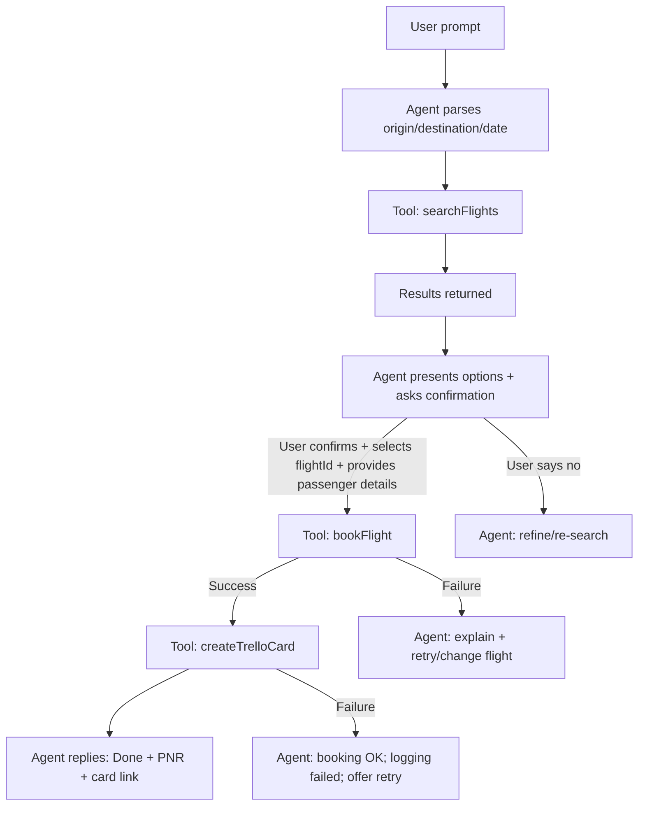

## Phase 0 — Foundation (no code)

Understand the system on paper before writing a single line.

---

## 1) Define what “tools” are

In this system, **tools are the agent’s only allowed actions** (side effects / API calls).  
The agent can chat and reason, but it can only *do things* by calling a tool with a **strict JSON input schema**, then using the **structured result** to decide what happens next.

### Every action the agent can take

- Interpret user intent and extract trip details (origin, destination, date, passengers, class)
- Ask clarifying questions when required fields are missing/ambiguous
- Call `searchFlights` to fetch options
- Present options (airline, price, departure/arrival times, `flightId`)
- Ask explicit confirmation **before booking**
- Collect passenger details (name, email, phone, seat preference)
- Call `bookFlight` **only after explicit confirmation**
- Report booking outcome (PNR / status / error)
- Call `createTrelloCard` immediately after a successful booking
- Report Trello outcome (card URL / error); booking remains confirmed even if logging fails

---

## 2) Tool schemas (JSON)

```json
[
  {
    "name": "searchFlights",
    "description": "Search for available flights between two cities on a given date. Returns a list of flight options with airline, price, departure time, and flight ID.",
    "input_schema": {
      "type": "object",
      "properties": {
        "origin": {
          "type": "string",
          "description": "Departure city or IATA airport code (e.g. 'Delhi' or 'DEL')"
        },
        "destination": {
          "type": "string",
          "description": "Arrival city or IATA airport code (e.g. 'Goa' or 'GOI')"
        },
        "date": {
          "type": "string",
          "format": "date",
          "description": "Travel date in YYYY-MM-DD format"
        },
        "passengers": {
          "type": "integer",
          "minimum": 1,
          "maximum": 9,
          "default": 1,
          "description": "Number of passengers"
        },
        "class": {
          "type": "string",
          "enum": ["economy", "business", "first"],
          "default": "economy",
          "description": "Seat class preference"
        }
      },
      "required": ["origin", "destination", "date"],
      "additionalProperties": false
    }
  },
  {
    "name": "bookFlight",
    "description": "Book a specific flight for a passenger. IMPORTANT: Only call this tool after the user has explicitly confirmed the booking. Returns a PNR (booking reference) and confirmation details.",
    "input_schema": {
      "type": "object",
      "properties": {
        "flightId": {
          "type": "string",
          "description": "The flight ID returned from searchFlights"
        },
        "passengerName": {
          "type": "string",
          "description": "Full name of the passenger as on government ID"
        },
        "passengerEmail": {
          "type": "string",
          "format": "email",
          "description": "Email address for booking confirmation"
        },
        "passengerPhone": {
          "type": "string",
          "description": "Contact phone number including country code (e.g. '+91 9876543210')"
        },
        "seatPreference": {
          "type": "string",
          "enum": ["window", "aisle", "middle", "no_preference"],
          "default": "no_preference",
          "description": "Preferred seat position"
        }
      },
      "required": ["flightId", "passengerName", "passengerEmail"],
      "additionalProperties": false
    }
  },
  {
    "name": "createTrelloCard",
    "description": "Create a Trello card to log a confirmed travel booking. Call this immediately after a successful bookFlight. The card serves as a permanent record of the booking in the user's Trello board.",
    "input_schema": {
      "type": "object",
      "properties": {
        "title": {
          "type": "string",
          "description": "Card title summarising the booking (e.g. 'Flight: Delhi → Goa | Indigo | ₹4500 | 10 Apr')"
        },
        "description": {
          "type": "string",
          "description": "Full booking details including PNR, passenger name, airline, departure time, and price"
        },
        "listId": {
          "type": "string",
          "description": "Trello list ID where this card should be created (from your board config)"
        },
        "dueDate": {
          "type": "string",
          "format": "date",
          "description": "The travel date as the card due date in YYYY-MM-DD format"
        },
        "labels": {
          "type": "array",
          "items": { "type": "string" },
          "description": "List of Trello label IDs to apply to the card"
        }
      },
      "required": ["title", "listId"],
      "additionalProperties": false
    }
  }
]
```

---

## 3) Define the agent flow on paper

### Exact flow: “Book Delhi to Goa”

- Step 1 → User sends prompt
- Step 2 → Agent calls `searchFlights()`
- Step 3 → Agent shows results, asks confirmation
- Step 4 → User says yes → agent calls `bookFlight()`
- Step 5 → `createTrelloCard()` logs the booking
- Step 6 → Agent replies “Done!”

### Visual flow



---

## 4) Tech stack choice (recommended)

- **AI brain**: Anthropic Claude API
- **Travel API**: mock JSON first → Amadeus sandbox later
- **Trello**: Trello REST API first (simple + reliable), then optional MCP integration
- **Runner**: Node.js CLI script (Cursor-friendly)
- **Language**: Node.js (CommonJS is fine)

---

## 5) Output checkpoint

We can answer all 4:

- Which tool runs first? **`searchFlights`**
- What does it return? **List of flight options (with `flightId`, airline, price, times)**
- When is the user asked? **After results are shown, before booking**
- When is Trello updated? **Immediately after a successful booking**

